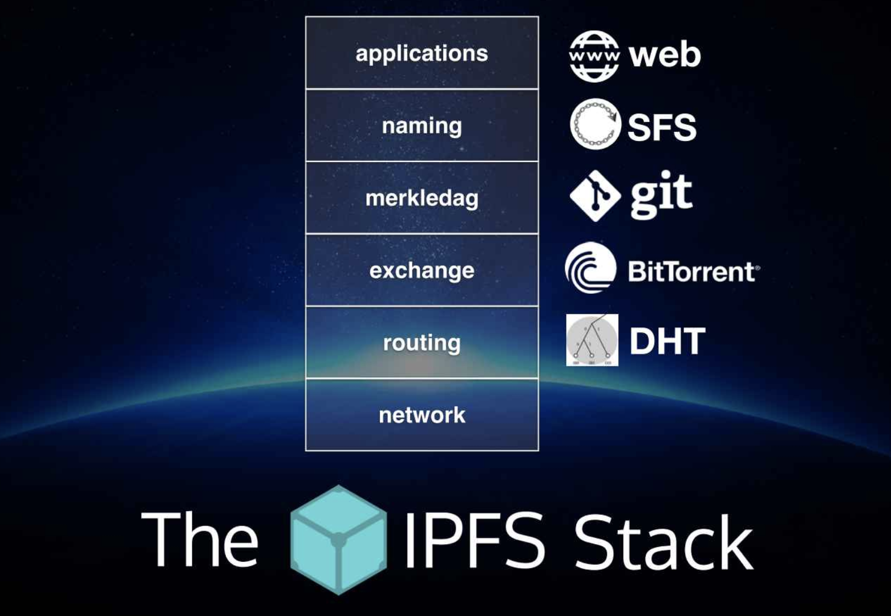

## IPFS (The InterPlanetary File System)

IPFS는 모든 컴퓨터를 하나의 파일 시스템으로 연결하는 것을 목표로 하는 p2p 분산 파일 시스템힙니다. 

### Why IPFS?

- HTTP의 문제점

  지금까지 HTTP는 가장 성공적인 분산 파일 시스템입니다. 인터넷 브라우저와 결합하여 HTTP는 기술적이고 사회적으로 엄청난 영향을 끼쳤습니다. 이 방식은 인터넷을 통해 파일 전송하는 대표적인 방법이 되었습니다. 그러나 기존의 Web은 많은 문제점을 가지고 있습니다.

  1. 불안정성

     HTTP는 클라이언트가 서버에서 데이터 요청을 보내면 서버에서 응답하여 데이터를 보내주는 구조로 되어있습니다. 만약 데이터를 소유하고 있는 서버가 꺼진다면, 해당 데이터에 접근할 수 있는 방법이 없습니다. 만약에 위키피디아가 해킹되어서 모든 데이터가 지워진다면, 우리는 복구 할 수 없고 그 지식을 모두 잃는 것입니다.

  2. 중앙화

     HTTP Web에서는 데이터가 극도로 중앙화 되어있기 때문에, 몇개의 서비스(facebook, instagram, google)가 우리 데이터의 대부분을 가지고 있습니다. 우리는 그 데이터가 어떻게 사용되는지 알지 못합니다. 이것은 상상도 못한 엄청난 힘이며, 몇 개 서비스들은 몇번의 클릭만으로 우리들을 손쉽게 조종할 수 있습니다. 정부 마음대로 특정 컨텐츠를 차단해버릴 수 도 있습니다.  

  3. Bandwidth

     점점 더 많은 데이터들이 빠르게 Web에 올라가고 있고, 더 많은 사람들이 Web의 데이터를 요구하고 있습니다. Web 사이트들은 종종 Crash가 발생하는데, 그 이유는 너무 많은 사람들이 동시에 접속하려고 하기 때문입니다. 

     예를 들어 200MB의 동영상을 Youtube에 업로드, 조회하는데 8개의 링크를 거쳐야 한다면, `200MB * 8 = 1.6GB`의 Bandwidth가 필요합니다. 이 동영상을 같은 반 30명의 친구들이 조회를 한다면 이는 `200MB * 8 * 30 = 48GB`의 Bandwidth를 필요로 할 것입니다. 이는 같은 반 친구들이 물리적으로 바로 옆에 있는 것을 생각한다면 매우 비효율적인 방법입니다.

  4. Latency

     데이터는 빛으로 통신하고 있기 때문에 전송 속도의 한계가 존재합니다. 따라서 데이터 전송을 빠르게 하는 유일한 방법은 해당 데이터를 근처에서 가져오는 것입니다. 이는 많은 클라우드 서비스들이 지역별로 데이터 센터를 두는 이유입니다.

- Data distribution의 트렌드

  1. Petabyte급 데이터 셋의 호스팅 및 배포

  2. 대용량 데이터 컴퓨팅

  3. High Volume, High definition 실시간 미디어 스트림

  4. 대용량 데이터의 버전관리 및 연결

  5. 의도하지 않은 중요한 파일들의 삭제 방지

- IPFS의 특징

  IPFS는 위의 문제점들을 해결하기 위해 디자인되었고, 중앙화된 서버 없이 노드들의 P2P를 기반으로한 더 빠르고 안전하며 열린 Web입니다. HTTP Web이 ip addressed인 반면, IPFS Web은 content addressed 방식을 사용합니다. content address방식은 IPFS의 노드들 중에 content를 가지고 있는 가까운 노드에게 요청을 하기 때문에 더 빠르고 효율적으로 데이터를 얻을 수 있습니다. IPFS에 업로드된 파일들은 영원이 기록되며, 파일의 버전관리(git)가 가능합니다.

### Technologies used in IPFS

IPFS는 목표를 실현하기 위해 컴퓨터 과학역사에서 중요한 다음과 같은 여러 개념, 기술들을 사용합니다.

- Distributed Hash Tables(DHT) - Routing
- BitTorrent - File exchange
- Git - Merkle DAG
- SFS - Naming